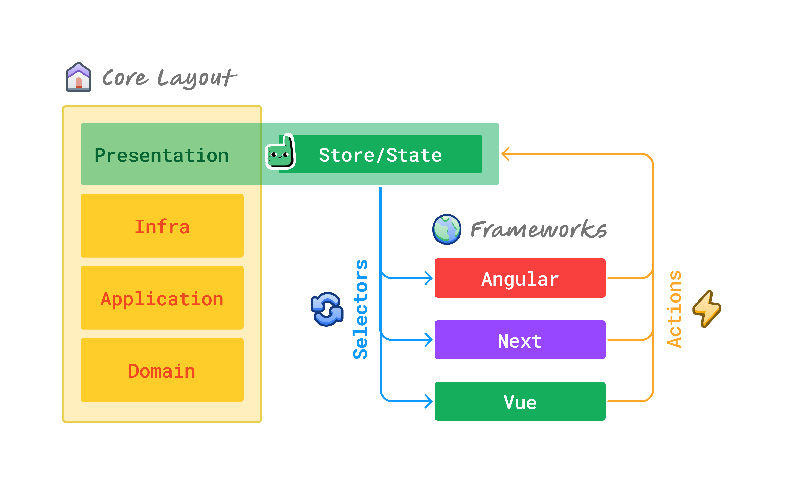

# Frontend Agnostic CA

## Overview

This project is an experimental **Clean Architecture** implementation in TypeScript.
The core of the application is designed to be framework-independent and can be 
used with different frontend frameworks, including **Angular, Vue 3, and 
Next.js 14**. Each framework has its own folder at the root level, and they all 
share the same core business logic.



## Key Features

- **Framework-Independent Core**: The core business logic is abstracted away 
from the frontend frameworks.
- **Zustand State Management**: Zustand is used for managing state across 
different frameworks.
- **Scalable Architecture**: Clean Architecture principles are applied to ensure 
a separation of concerns and maintainability.
- **Multi-Framework Support**: The same core logic can be plugged into different 
frameworks like Angular, Vue 3, and Next.js 14.

## Project Structure
```shell
root
│
├── core/
│   ├── (module)
│   │   ├── application/        # Use cases and input/output ports
│   │   ├── domain/             # Domain entities and business rules
│   │   ├── infra/              # External dependencies
│   │   └── presentation/store/ # Zustand state management setup
│   └── common/
│
├── angular/
├── vue/
└── next/
```